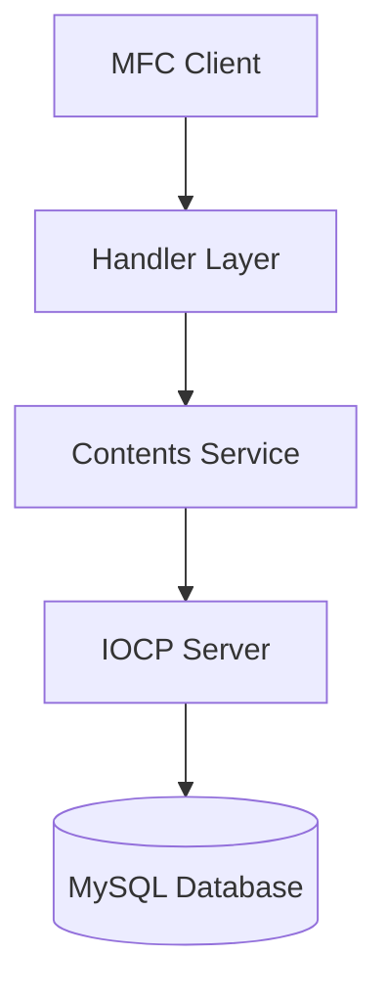
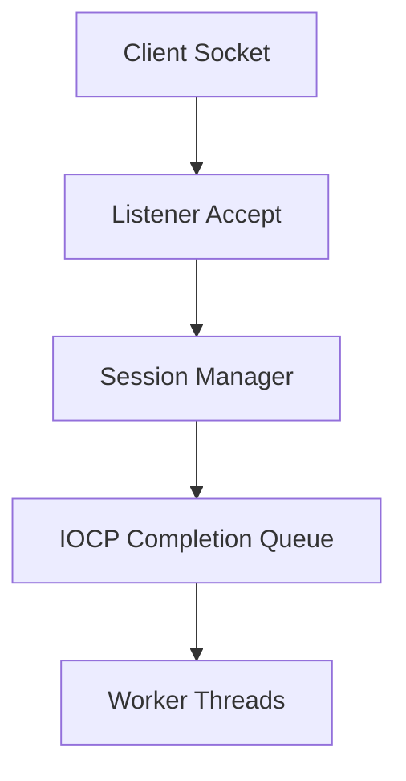

# IOCP Chatting System

Windows **IOCP 기반 비동기 네트워크 서버**와 **MFC 클라이언트**를 활용하여 구현한 채팅 시스템입니다.

회원가입, 로그인, 채팅방 생성/입장, 실시간 채팅 기능을 포함하며  
다수의 클라이언트를 동시에 처리할 수 있는 **비동기 서버 구조**를 구현했습니다.

---

# Tech Stack

## Language
- C++

## Network
- Winsock2
- IOCP

## Client
- MFC

## Database
- MySQL
- ODBC

---

# System Architecture

# Server Architecture

