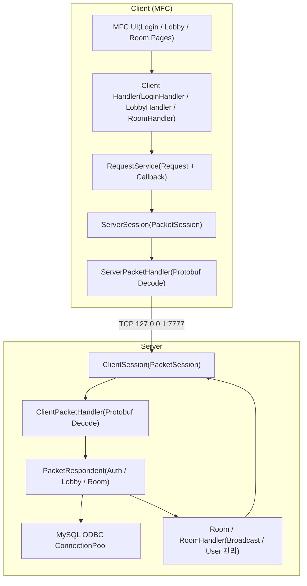
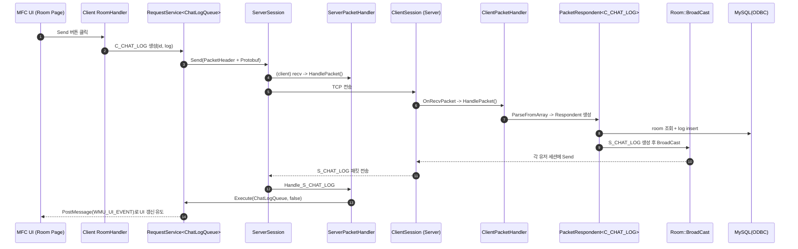

# ChattingProgram
IOCP(ServerCore) + Protobuf + MySQL(ODBC) 기반의 **MFC 채팅 클라이언트/고성능 서버** 프로젝트입니다.

## 개발 상태
- 구현됨
  - 로그인 / 회원가입
  - 로비: 방 목록 갱신 / 방 생성 / 방 입장
  - 룸: 채팅 전송(브로드캐스트) / 퇴장 / 유저 목록 갱신
- 추후 업데이트 가능성
  - 자동화 확장
  - 친구 기능 추가

## 기술 스택
- Language: C++ (Windows)
- Network: IOCP 기반 비동기 소켓(ServerCore)
- Serialization: **Google Protocol Buffers (C++ generated `Protocol.pb.h/.cc`)**
- Client UI: MFC(Dialog 기반, 페이지 전환 구조)
- DB: MySQL + ODBC(Unicode Driver) + 바인딩 유틸(DBBind/ConnectionPool)

## Concurrency & Core Design

- **IOCP Networking**  
  Windows IOCP 모델을 활용하여 다수의 클라이언트 연결을 비동기 방식으로 처리하고, Worker Thread가 Completion Queue의 이벤트를 처리하도록 구성했습니다.

- **Session 기반 연결 관리**  
  각 클라이언트 연결을 Session 객체로 관리하여 소켓, 패킷 처리, 연결 상태를 일관된 구조로 유지했습니다.

- **PacketSession + PacketHeader 구조**  
  고정 PacketHeader(size, id)와 Protobuf 메시지를 조합한 구조를 사용하여 패킷 파싱과 메시지 확장을 쉽게 설계했습니다.

- **Protocol Buffers 기반 메시지 직렬화**  
  Protobuf를 활용하여 네트워크 메시지를 직렬화하고, 클라이언트와 서버 간 동일한 프로토콜 구조를 유지했습니다.

- **RequestService 구조**  
  클라이언트 요청을 RequestService<T>로 캡슐화하여 요청 전송과 응답 콜백 처리를 분리하고, 비동기 요청 흐름을 명확하게 관리했습니다.

- **PacketRespondent 구조**  
  서버에서 수신한 패킷을 PacketRespondent<T>를 통해 처리하여 패킷 타입별 처리 로직을 모듈화했습니다.

- **Room 관리 시스템**  
  채팅방 단위로 사용자 세션을 관리하고 Broadcast를 통해 동일 방 사용자에게 메시지를 전파하는 구조를 구현했습니다.

- **JobQueue 기반 작업 실행 구조**  
  네트워크 이벤트와 실제 서비스 로직 실행을 분리하기 위해 JobQueue를 사용하여 작업을 큐에 적재하고 순차적으로 실행하도록 설계했습니다.

- **Custom RWLock 구현**  
  읽기 작업을 병렬로 허용하고 쓰기 작업을 단독 수행하도록 하는 RWLock을 구현하여 읽기 중심 데이터 접근에서 Mutex보다 효율적인 동기화를 적용했습니다.

- **ODBC ConnectionPool 기반 DB 접근**  
  DB 접근 시 ConnectionPool을 사용하여 연결 재사용을 가능하게 하고 서버 성능 저하를 방지했습니다.


## 실행 화면 안내 및 DB Table
<table>
  <tr>
    <td></td>
    <td></td>
    <td></td>
  </tr>
</table>
<table>
  <tr>
    <td></td>
    <td></td>
    <td></td>
  </tr>
</table>


## 전체 시스템 아키텍처 / 서버 아키텍처 (Mermaid)




## 채팅 처리 시퀀스 (Mermaid)



## 핵심 코드 스니펫

### IOCP 디스패치 코어
```cpp
// ServerCore/IocpCore.cpp
_iocpHandle = ::CreateIoCompletionPort(INVALID_HANDLE_VALUE, 0, 0, 0);

if (::GetQueuedCompletionStatus(_iocpHandle, OUT &numOfBytes, OUT &key,
    OUT reinterpret_cast<LPOVERLAPPED*>(&iocpEvent), timeoutMs))
{
    shared_ptr<IocpObject> iocpObject = iocpEvent->owner;
    iocpObject->Dispatch(iocpEvent, numOfBytes);
}
```

### 패킷 프레이밍: PacketHeader
```cpp
// ServerCore/Session.h
struct PacketHeader
{
  uint16_t size;
  uint16_t id;
};
```

### Protobuf 기반 패킷 파싱/직렬화
```cpp
// Server/ClientPacketHandler.h (Client도 동일한 패턴: Client/ServerPacketHandler.h)
template<typename PacketType, typename ProcessFunc>
static bool HandlePacket(ProcessFunc func, shared_ptr<PacketSession>& session, BYTE* buffer, int32_t len)
{
  PacketType pkt;
  if (pkt.ParseFromArray(buffer + sizeof(PacketHeader), len - sizeof(PacketHeader)) == false)
    return false;

  return func(session, pkt);
}

template<typename T>
static shared_ptr<SendBuffer> MakeSendBuffer(T& pkt, uint16_t pktId)
{
  const uint16_t dataSize = static_cast<uint16_t>(pkt.ByteSizeLong());
  const uint16_t packetSize = dataSize + sizeof(PacketHeader);

  shared_ptr<SendBuffer> sendBuffer = GSendBufferManager->Open(packetSize);
  PacketHeader* header = reinterpret_cast<PacketHeader*>(sendBuffer->Buffer());
  header->size = packetSize;
  header->id = pktId;

  ASSERT_CRASH(pkt.SerializeToArray(&header[1], dataSize));
  sendBuffer->Close(packetSize);
  return sendBuffer;
}
```

### 서버 부팅: DB 스키마 초기화 + 워커 스레드
```cpp
// Server/Server.cpp (요약)
ASSERT_CRASH(GDBConnectionPool->Connect(20, L"DRIVER={MySQL ODBC 8.0 Unicode Driver};SERVER=localhost;PORT=3306;DATABASE=chat;UID=root;PWD=1234;"));

query = L"DROP TABLE IF EXISTS `chat`.`log`;";
dbConn->Execute(query);
// ... account, room drop ...

// room/account/log CREATE TABLE ...
ClientPacketHandler::Init();
service = std::make_shared<ServerService>(NetAddress(L"127.0.0.1", 7777), make_shared<IocpCore>(), make_shared<ClientSession>, 100);
ASSERT_CRASH(service->Start());

// Worker threads: Dispatch + JobQueue
service->GetIocpCore()->Dispatch(10);
JobQueue::ExcuteGlobalJobs();
```

### 룸 브로드캐스트
```cpp
// Server/RoomHandler.h
template<typename T>
void BroadCast(T&& pkt, shared_ptr<PacketSession> excluUser = nullptr)
{
  WriteLockGuard guard(_lock);
  for (auto& [id, user] : _users)
  {
    if (excluUser && excluUser == user) continue;
    auto sendBuffer = ClientPacketHandler::MakeSendBuffer(pkt);
    user->Send(sendBuffer);
  }
}
```

### 클라이언트: 네트워크 수신 → UI 이벤트 라우팅
```cpp
// Client/CMainDialog.cpp
LRESULT CMainDialog::OnUIEvent(WPARAM wParam, LPARAM lParam)
{
  UIEvent ev = static_cast<UIEvent>(wParam);
  auto it = _eventMap.find(ev);
  if (it == _eventMap.end()) return -1;

  CDialogEx* sender = it->second.first;
  it->second.second->Execute(ev, sender);
  return 0;
}
```

## DB 스키마 (서버 코드 기반)
> 실제 생성 SQL은 `Server/Server.cpp`에 포함되어 있으며, 아래는 핵심 컬럼만 요약한 형태입니다.

```sql
-- chat.room
room_id INT AUTO_INCREMENT PRIMARY KEY
room_name VARCHAR(30) NOT NULL UNIQUE
user_count INT NOT NULL DEFAULT 1

-- chat.account
id VARCHAR(30) PRIMARY KEY
password VARCHAR(255) NOT NULL
create_date DATETIME NOT NULL DEFAULT CURRENT_TIMESTAMP
is_online BOOL NOT NULL DEFAULT 0
current_room_id INT NULL
FOREIGN KEY (current_room_id) REFERENCES chat.room(room_id) ON DELETE SET NULL ON UPDATE CASCADE

-- chat.log
log_id INT AUTO_INCREMENT PRIMARY KEY
account_id VARCHAR(30)
room_id INT
message TEXT NOT NULL
send_date DATETIME NOT NULL DEFAULT CURRENT_TIMESTAMP
FOREIGN KEY (account_id) REFERENCES chat.account(id) ON DELETE CASCADE ON UPDATE CASCADE
FOREIGN KEY (room_id) REFERENCES chat.room(room_id) ON DELETE CASCADE ON UPDATE CASCADE
```

## 실행 방법 (로컬)
1. MySQL 준비: `chat` DB 생성, ODBC 드라이버 설정(Unicode Driver)
2. Server 실행
   - 실행 시 `room/account/log` 테이블을 DROP/CREATE 합니다(개발 모드).
   - 기본 포트: `127.0.0.1:7777`
3. Client 실행(MFC)
   - 실행 시 IOCP ClientService가 서버에 연결합니다.
4. 동작 플로우
   - 로그인/회원가입 → 로비에서 방 생성/입장 → 룸에서 채팅 전송/퇴장

## 회고
- IOCP 코어를 ServerCore로 분리하면서, 네트워크 이벤트 루프와 컨텐츠 로직을 명확히 분리할 수 있었습니다.
- Protobuf + PacketHeader 조합으로 바이너리 프로토콜을 단순화했고, 핸들러 테이블 기반 디스패치로 확장성을 확보했습니다.
- MFC UI는 메시지 기반(WMU_UI_EVENT)으로 네트워크 스레드와 UI 스레드의 경계를 분명히 했습니다.
