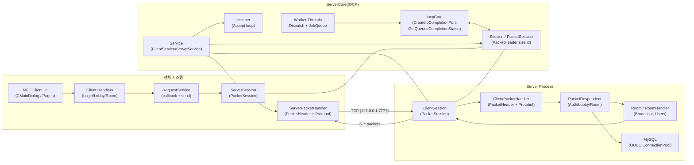
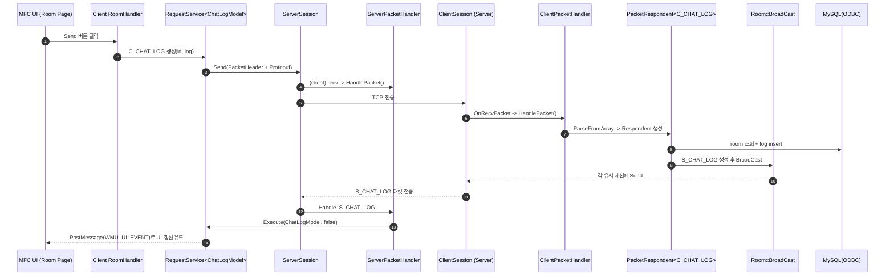

# ChattingProgram
IOCP(ServerCore) + Protobuf + MySQL(ODBC) 기반의 **MFC 채팅 클라이언트/서버** 프로젝트입니다.

## 개발 상태
- 구현됨
  - 로그인 / 회원가입 (`C_LOGIN`, `C_REGISTER`)
  - 로비: 방 목록 갱신 / 방 생성 / 방 입장 (`C_REFRESH_LOBBY`, `C_CREATE_ROOM`, `C_JOIN_ROOM`)
  - 룸: 채팅 전송(브로드캐스트) / 퇴장 / 유저 목록 갱신 (`C_CHAT_LOG`, `C_ROOM_OUT`, `S_REFRESH_ROOM`)
- TODO(개선 여지)
  - DB 문자열 버퍼 길이(현재 14) 확장 또는 동적 처리
  - 스키마 DROP/CREATE 개발모드 분리 및 설정

## 기술 스택
- Language: C++ (Windows)
- Network: IOCP 기반 비동기 소켓(ServerCore)
- Serialization: **Google Protocol Buffers (C++ generated `Protocol.pb.h/.cc`)**
- Client UI: MFC(Dialog 기반, 페이지 전환 구조)
- DB: MySQL + ODBC(Unicode Driver) + 바인딩 유틸(DBBind/ConnectionPool)

## 전체 시스템 아키텍처 / 서버 아키텍처 (Mermaid)



## 채팅 처리 시퀀스 (Mermaid)



## 핵심 코드 스니펫

### IOCP 디스패치 코어
```cpp
// ServerCore/IocpCore.cpp
_iocpHandle = ::CreateIoCompletionPort(INVALID_HANDLE_VALUE, 0, 0, 0);

if (::GetQueuedCompletionStatus(_iocpHandle, OUT &numOfBytes, OUT &key,
    OUT reinterpret_cast<LPOVERLAPPED*>(&iocpEvent), timeoutMs))
{
    shared_ptr<IocpObject> iocpObject = iocpEvent->owner;
    iocpObject->Dispatch(iocpEvent, numOfBytes);
}
```

### 패킷 프레이밍: PacketHeader
```cpp
// ServerCore/Session.h
struct PacketHeader
{
  uint16_t size;
  uint16_t id;
};
```

### Protobuf 기반 패킷 파싱/직렬화
```cpp
// Server/ClientPacketHandler.h (Client도 동일한 패턴: Client/ServerPacketHandler.h)
template<typename PacketType, typename ProcessFunc>
static bool HandlePacket(ProcessFunc func, shared_ptr<PacketSession>& session, BYTE* buffer, int32_t len)
{
  PacketType pkt;
  if (pkt.ParseFromArray(buffer + sizeof(PacketHeader), len - sizeof(PacketHeader)) == false)
    return false;

  return func(session, pkt);
}

template<typename T>
static shared_ptr<SendBuffer> MakeSendBuffer(T& pkt, uint16_t pktId)
{
  const uint16_t dataSize = static_cast<uint16_t>(pkt.ByteSizeLong());
  const uint16_t packetSize = dataSize + sizeof(PacketHeader);

  shared_ptr<SendBuffer> sendBuffer = GSendBufferManager->Open(packetSize);
  PacketHeader* header = reinterpret_cast<PacketHeader*>(sendBuffer->Buffer());
  header->size = packetSize;
  header->id = pktId;

  ASSERT_CRASH(pkt.SerializeToArray(&header[1], dataSize));
  sendBuffer->Close(packetSize);
  return sendBuffer;
}
```

### 서버 부팅: DB 스키마 초기화 + 워커 스레드
```cpp
// Server/Server.cpp (요약)
ASSERT_CRASH(GDBConnectionPool->Connect(20, L"DRIVER={MySQL ODBC 8.0 Unicode Driver};SERVER=localhost;PORT=3306;DATABASE=chat;UID=root;PWD=1234;"));

query = L"DROP TABLE IF EXISTS `chat`.`log`;";
dbConn->Execute(query);
// ... account, room drop ...

// room/account/log CREATE TABLE ...
ClientPacketHandler::Init();
service = std::make_shared<ServerService>(NetAddress(L"127.0.0.1", 7777), make_shared<IocpCore>(), make_shared<ClientSession>, 100);
ASSERT_CRASH(service->Start());

// Worker threads: Dispatch + JobQueue
service->GetIocpCore()->Dispatch(10);
JobQueue::ExcuteGlobalJobs();
```

### 룸 브로드캐스트
```cpp
// Server/RoomHandler.h
template<typename T>
void BroadCast(T&& pkt, shared_ptr<PacketSession> excluUser = nullptr)
{
  WriteLockGuard guard(_lock);
  for (auto& [id, user] : _users)
  {
    if (excluUser && excluUser == user) continue;
    auto sendBuffer = ClientPacketHandler::MakeSendBuffer(pkt);
    user->Send(sendBuffer);
  }
}
```

### 클라이언트: 네트워크 수신 → UI 이벤트 라우팅
```cpp
// Client/CMainDialog.cpp
LRESULT CMainDialog::OnUIEvent(WPARAM wParam, LPARAM lParam)
{
  UIEvent ev = static_cast<UIEvent>(wParam);
  auto it = _eventMap.find(ev);
  if (it == _eventMap.end()) return -1;

  CDialogEx* sender = it->second.first;
  it->second.second->Execute(ev, sender);
  return 0;
}
```

## DB 스키마 (서버 코드 기반)
> 실제 생성 SQL은 `Server/Server.cpp`에 포함되어 있으며, 아래는 핵심 컬럼만 요약한 형태입니다.

```sql
-- chat.room
room_id INT AUTO_INCREMENT PRIMARY KEY
room_name VARCHAR(30) NOT NULL UNIQUE
user_count INT NOT NULL DEFAULT 1

-- chat.account
id VARCHAR(30) PRIMARY KEY
password VARCHAR(255) NOT NULL
create_date DATETIME NOT NULL DEFAULT CURRENT_TIMESTAMP
is_online BOOL NOT NULL DEFAULT 0
current_room_id INT NULL
FOREIGN KEY (current_room_id) REFERENCES chat.room(room_id) ON DELETE SET NULL ON UPDATE CASCADE

-- chat.log
log_id INT AUTO_INCREMENT PRIMARY KEY
account_id VARCHAR(30)
room_id INT
message TEXT NOT NULL
send_date DATETIME NOT NULL DEFAULT CURRENT_TIMESTAMP
FOREIGN KEY (account_id) REFERENCES chat.account(id) ON DELETE CASCADE ON UPDATE CASCADE
FOREIGN KEY (room_id) REFERENCES chat.room(room_id) ON DELETE CASCADE ON UPDATE CASCADE
```

## 프로젝트 디렉터리 트리 (분석 범위만)
```text
ServerCore/
  IocpCore.cpp/h
  Session.h/.cpp
  Service.cpp/h
  Listener.cpp/h
  JobQueue.cpp/h
  DBConnectionPool.cpp/h
  ...

Server/
  Server.cpp
  ClientSession.cpp/h
  ClientPacketHandler.cpp/h
  LobbyRespondent.h
  RoomRepondent.h
  RoomHandler.cpp/h
  Protocol.pb.cc/h

Client/
  Client.cpp
  CMainDialog.cpp/h
  CommandMapper.cpp/h
  UIEvent.h
  ContentsService.h
  Model.h
  ServerSession.cpp/h
  ServerPacketHandler.cpp/h
  LoginHandler.cpp/h
  RoomHandler.cpp/h
  Protocol.pb.cc/h
```

## 실행 방법 (로컬)
1. MySQL 준비: `chat` DB 생성, ODBC 드라이버 설정(Unicode Driver)
2. Server 실행
   - 실행 시 `room/account/log` 테이블을 DROP/CREATE 합니다(개발 모드).
   - 기본 포트: `127.0.0.1:7777`
3. Client 실행(MFC)
   - 실행 시 IOCP ClientService가 서버에 연결합니다.
4. 동작 플로우
   - 로그인/회원가입 → 로비에서 방 생성/입장 → 룸에서 채팅 전송/퇴장

## 실행 화면 안내 (스크린샷 추천)
- (1) 로그인 페이지: ID/PW 입력 + 로그인/회원가입 버튼
- (2) 로비 페이지: 방 목록/유저 수 표시, 새 방 생성/입장
- (3) 룸 페이지: 유저 리스트, 채팅 로그, 전송/퇴장 버튼
- (4) DB: room/account/log 테이블 상태(예: Workbench에서 SELECT 결과)

## 회고
- IOCP 코어를 ServerCore로 분리하면서, 네트워크 이벤트 루프와 컨텐츠 로직을 명확히 분리할 수 있었습니다.
- Protobuf + PacketHeader 조합으로 바이너리 프로토콜을 단순화했고, 핸들러 테이블 기반 디스패치로 확장성을 확보했습니다.
- MFC UI는 메시지 기반(WMU_UI_EVENT)으로 네트워크 스레드와 UI 스레드의 경계를 분명히 했습니다.
