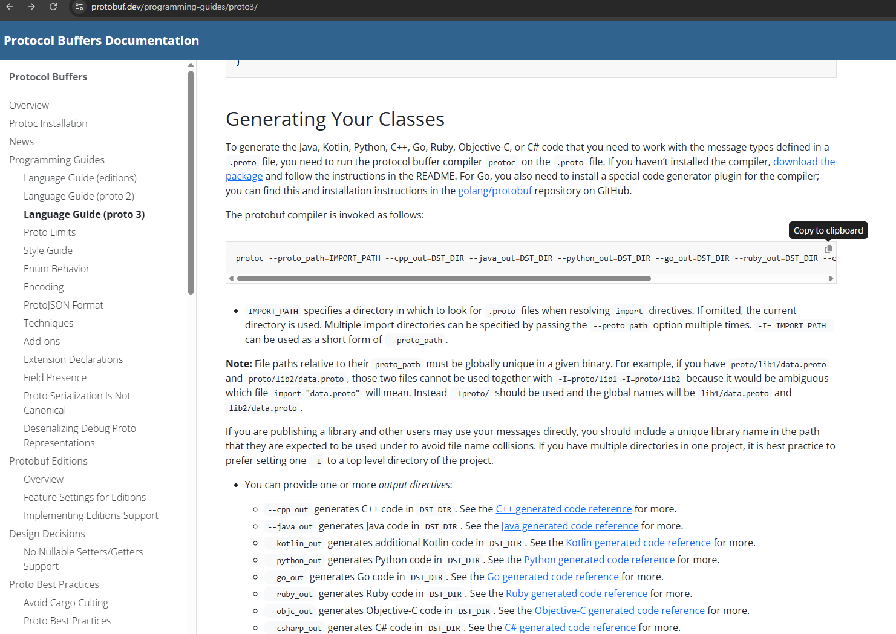
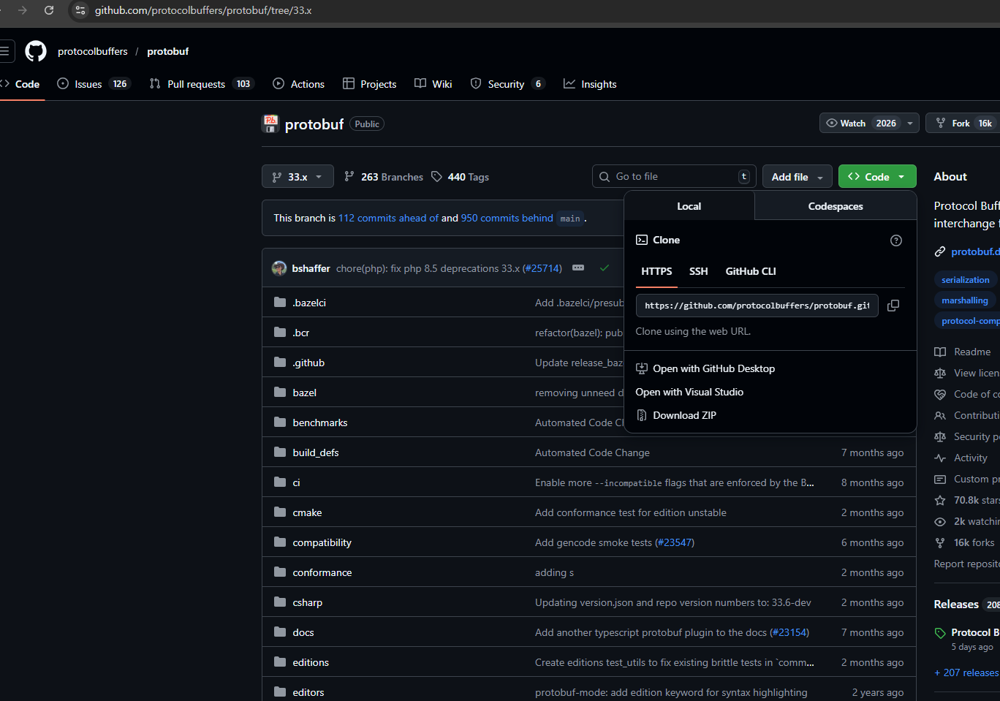
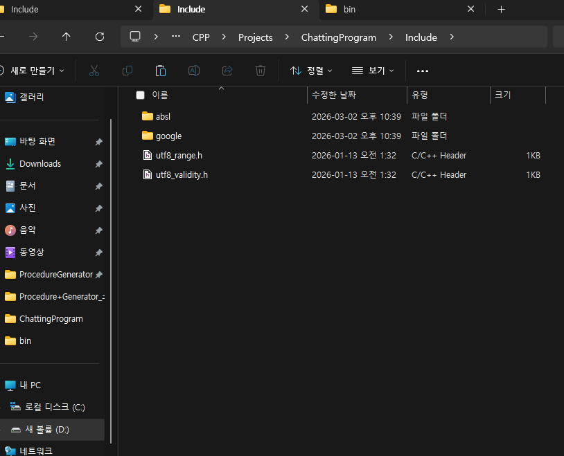
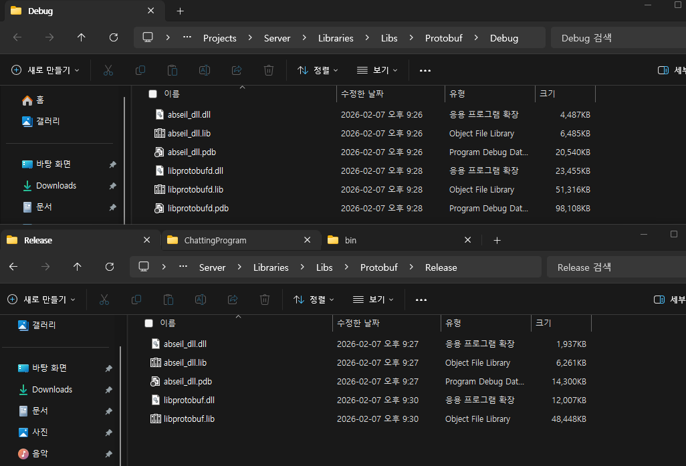

# ChattingProgram
ChattingProgram Development

### 서버코어 완료, mfc진행중
-

## 까먹었을때 보기 위해 기록 해두는것

- ### Protobuf
    1. Proto compiler 다운 ([경로](https://github.com/protocolbuffers/protobuf/releases))
    2. 압축해제 후, 본인 프로젝트 적당한 위치에 추가
    3. proto, bat(자동화) 등 팔요한 생성 후 작성
        - ([공식문서](https://protobuf.dev/)) :
            공식문서에서 작성헤야할 명령어들을 참고.
        
    
    4. proto파일로 만들어진 cc, h파일이 참조하는 소스코드 다운([경로](https://github.com/protocolbuffers/protobuf/tree/33.x))
        - 프로토 컴파일 버전과 맞게 하는것을 권장
        

    5. 다운된 소스 파일중 해당 파일들을 프로젝트내의 적절한 위치에 추가
         - 

    6. 이후 라이브러리로 빌드 해주기위해 cmake,또는 vcpkg를 활용해야한다.([참고](https://minttea25.tistory.com/128))
    7. 버전마다 조금 다를 순 있는데 생성된 파일들중 아래 이미지에 해당하는 파일들을 찾아 본인 프로젝트의 라이브러리 폴더에 추가해준다(dll파일들은 exe파일이 있는 폴더에 추가).
        - 
    
    8. 디렉터리참조 설정이랑 라이브러리참조 설정은 알아서하기

